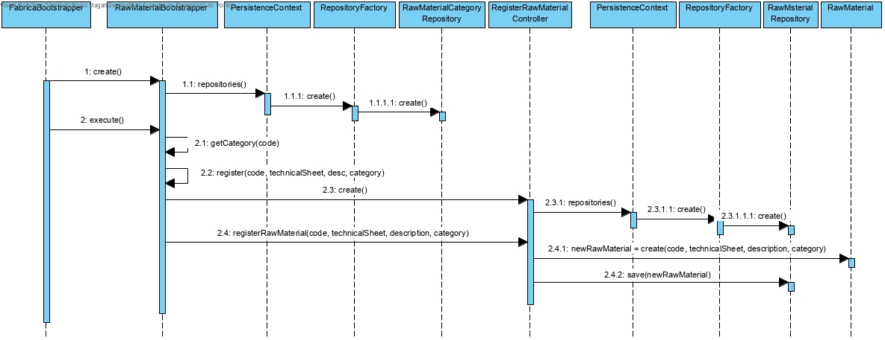
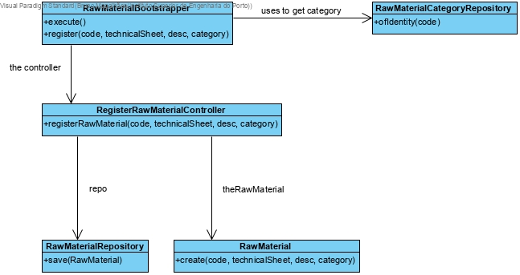

# Registar Material (Bootstrap)
=======================================

# 1. Requisitos

**Demo1** Como Gestor de Projeto, eu pretendo que a equipa proceda à inicialização (bootstrap) de algumas matérias-primas.

A interpretação feita deste requisito foi no sentido de criar uma forma de carregar para a base de dados algumas matérias primas.

# 2. Análise

Enquanto é desenvolvido o programa é de interesse que não se tenha de inserir informação na base de dados de cada vez que o programa precisa ser testado. Sendo assim, faz-se bootstrap de matérias primas de forma a agilizar e a rentabilizar melhor o tempo da equipa no desenvolvimento do software.

# 3. Design

A forma encontrada para resolver este problema foi criar uma classe **RawMaterialBootstrapper** que faz uso do **RegisterRawMaterialController** para criar instâncias de forma a garantir as regras de negócio dadas pelo cliente sem ter o intermédio de uma UI.

## 3.1. Realização da Funcionalidade

## 3.2. Diagrama de Classes

## 3.3. Padrões Aplicados

*Bootstrapper*
*Controller*

## 3.4. Testes

Os testes aplicados aqui são os aplicados no RegisterRawMaterial.

# 4. Implementação

*Nesta secção a equipa deve providenciar, se necessário, algumas evidências de que a implementação está em conformidade com o design efetuado. Para além disso, deve mencionar/descrever a existência de outros ficheiros (e.g. de configuração) relevantes e destacar commits relevantes;*

*Recomenda-se que organize este conteúdo por subsecções.*

# 5. Integração/Demonstração

*Nesta secção a equipa deve descrever os esforços realizados no sentido de integrar a funcionalidade desenvolvida com as restantes funcionalidades do sistema.*

# 6. Observações

*Nesta secção sugere-se que a equipa apresente uma perspetiva critica sobre o trabalho desenvolvido apontando, por exemplo, outras alternativas e ou trabalhos futuros relacionados.*
