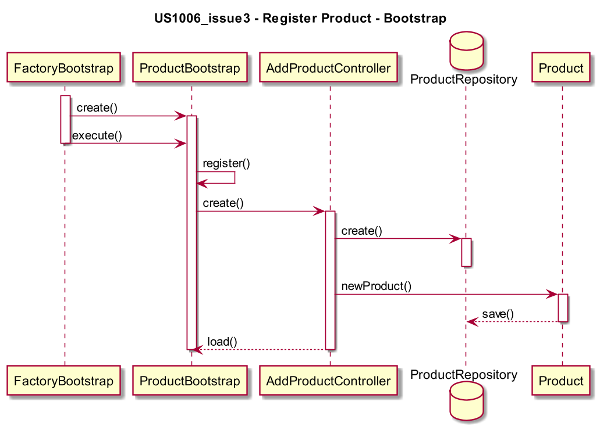

# US1006_issue3 - Register Product - Bootstrap
=======================================

# 1. Requisitos

**US1006** Como Gestor de Projeto, eu pretendo que a equipa proceda à inicialização (bootstrap) de alguns produtos.

A interpretação feita deste requisito foi no sentido de criar uma forma de carregar para a base de dados alguns produtos, assim que a aplicação é inicializada.

# 2. Análise

Enquanto é desenvolvido o programa é de interesse que não se tenha de inserir informação na base de dados de cada vez que o programa precisa ser testado. Sendo assim, corre-se o Bootstrap dos Produtos de forma a agilizar e a rentabilizar melhor o tempo da equipa no desenvolvimento do software.

# 3. Design

A forma encontrada para resolver este problema foi criar uma classe **ProductBootstrapper** que faz uso do **RegisterProductController** para criar instâncias e as guardar no **ProductRepository** de forma a garantir as regras de negócio dadas pelo cliente sem ter o intermédio de uma UI.

## 3.1. Realização da Funcionalidade

## * 3.2. Diagrama de Classes

## 3.3. Padrões Aplicados

* *Bootstrapper*
* *Factory*
* *Controller*

## 3.4. Testes

*Como testar o Bootstrapper?*

# 4. Implementação

A class **ProductBootstrapper** encontra-se inserida no Package *package eapli.base.infrastructure.bootstrapers.demo* e acede/instancia o **ProductRepository**.

# 5. Integração/Demonstração

*Nesta secção a equipa deve descrever os esforços realizados no sentido de integrar a funcionalidade desenvolvida com as restantes funcionalidades do sistema.*

# 6. Observações

Nada a registar.
