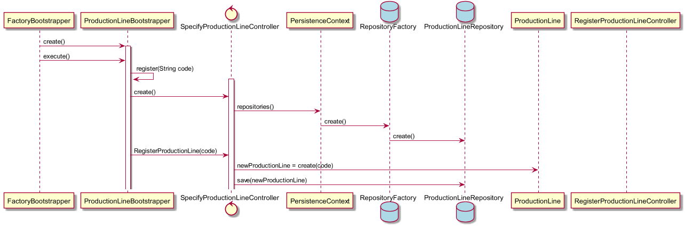

# Especificar Linha de Produção (Bootstrap)
=======================================

# 1. Requisitos

**US1008** - Como Gestor de Projeto, eu pretendo que a equipa proceda à inicialização (bootstrap) de algumas linhas de produção.

A interpretação feita deste requisito foi no sentido de criar uma forma de carregar para a base de dados algumas linhas de produção.

# 2. Análise

Enquanto é desenvolvido o programa é de interesse que não se tenha de inserir informação na base de dados de cada vez que o programa precisa ser testado. Sendo assim, faz-se bootstrap de linhas de produção de forma a agilizar e a rentabilizar melhor o tempo da equipa no desenvolvimento do software.

# 3. Design

A forma encontrada para resolver este problema foi criar uma classe **ProductionLineBootstrapper** que faz uso do **SpecifyProductionLineController** para criar instâncias, de forma a garantir as regras de negócio dadas pelo cliente sem ter uma UI a agir como forma de interação.

## 3.1. Realização da Funcionalidade

## 3.3. Padrões Aplicados

* Bootstrapper
* Controller
* Factory

## 3.4. Testes

**Teste:** Garantir que nao pode ser criada uma linha de produção com valores nulos.

# 4. Implementação

*N/A*

# 5. Integração/Demonstração

*N/A*

# 6. Observações

*N/A*