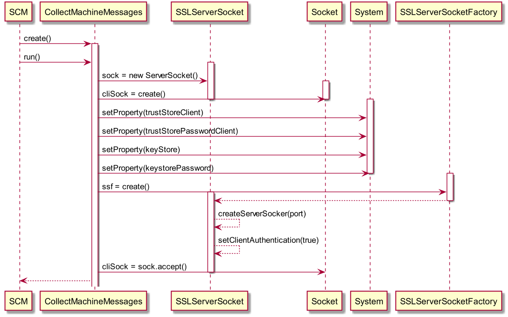

# Comunicações protegidas entre o SCM e as máquinas
=======================================

# 1. Requisitos

**US1013** - Como Gestor de Projeto, eu pretendo que as comunicações entre o SCM e as máquinas estejam protegidas.
A interpretação feita deste caso de uso, foi no sentido de proteger as ligações client-server entre SCM e simulador de máquinas. Para isso teremos de recorrer ao protocolo de encriptação, Transport Layer Protocol. Esta adição ao projeto, em nada deve alterar o funcionamento normal do programa, apenas deve proteger a ligação efetuada através de um socket quando as duas partes estabelecem comunicação.

# 2. Análise

Para a resolução desta funcionalidade, a proteção será protegida nas comunicações *TCP*.
Na cadeia de eventos, que leva à comunicação Java-C (SCM-Máquinas), já implementada no Sprint anterior, devem ser feitas alterações, para que o socket usado, seja protegido através de TLS/SSL. Para isso será necessário uma Java KeyStore (JKS) em comum, que é essencialmente um repositório de certificados de segurança. Neste sentido, daremos uso a bibliotecas específicas associadas a este protocolo. Começaremos por adicionar às propriedades do sistema os certificados necessários a que o servidor pode confiar por parte de clients autorizados, e adicionar também os certificados e palavra-chave ao próprio servidor.
Será usada a classe *SSLServerSocketFactory* e será obtida a Server Factory standard, será criada a socket de comunicação, onde a esta, será dito que qualquer client-side que tente a comunicação, necessitará de autenticação.

# 3. Design

Ao inicializar o programa, o Backoffice, será criada uma thread para as funcionalidades associadas à extração de mensagens a partir de uma pasta externa, e de seguida, será iniciada numa outra thread, a cadeia de eventos associada à recolha das ditas mensagens. Neste momento, serão feitos os *setProperty*, da informação necessária à comunicação segura entre ambos os nodes, conforme descrito na Análise acima. Será usada a classe *SSLServerSocketFactory*, da biblioteca *javax.net.ssl*, onde será criado o server socket com a porta através de onde será feita a instauração de comunicação. Após isto, ao socket criado, será dito essencialmente qualquer client-side node que efetue ligação a este, precisará de autenticação, isto é, precisará de conhecer os certificados/password necessários.
Após a ligação ter sido estabelecida com sucesso, o caso de uso adjacente à comunicação por TCP, continua a sua execução conforme a implementação do sprint anterior.

## 3.1. Realização da Funcionalidade

## 3.3. Padrões Aplicados

* Controller

## 3.4. Testes

*N/A*

# 4. Implementação

*N/A*

# 5. Integração/Demonstração

*N/A*

# 6. Observações

*N/A*
