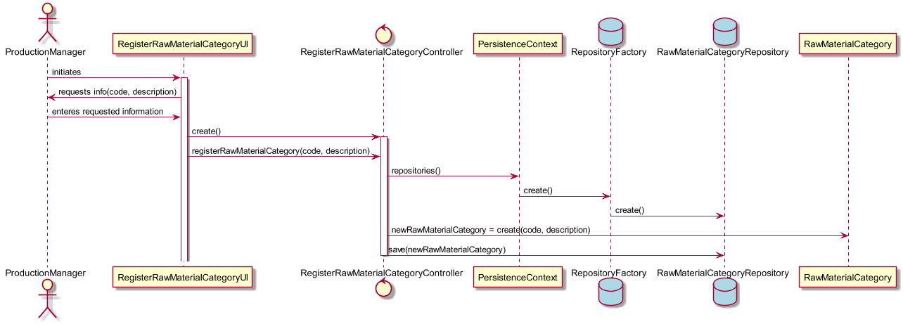

# Processo Engenharia Funcionalidade
=======================================

# 1. Requisitos

**Demo1** Como Gestor de Produção, eu pretendo adicionar uma categoria de matéria-prima.

A interpretação feita deste requisito foi no sentido de permitir a adição de uma categoria de matéria-prima à base de dados.

# 2. Análise

A qualquer momento pode ser relevante a adição de uma categoria de matéria-prima para a base de dados.

# 3. Design

A forma encontrada para resolver este problema foi através do uso da class **RegisterRawMaterialCategoryUI** de forma a garantir as regras de negócio dadas pelo cliente, permitindo assim a adição de uma categoria de matéria-prima à base de dados, ou seja, ao **RawMaterialCategoryRepository**.

## 3.1. Realização da Funcionalidade

## 3.3. Padrões Aplicados

* Bootstrapper
* Controller

## 3.4. Testes

*N/A*

# 4. Implementação

*N/A*

# 5. Integração/Demonstração

*N/A*

# 6. Observações

*N/A*