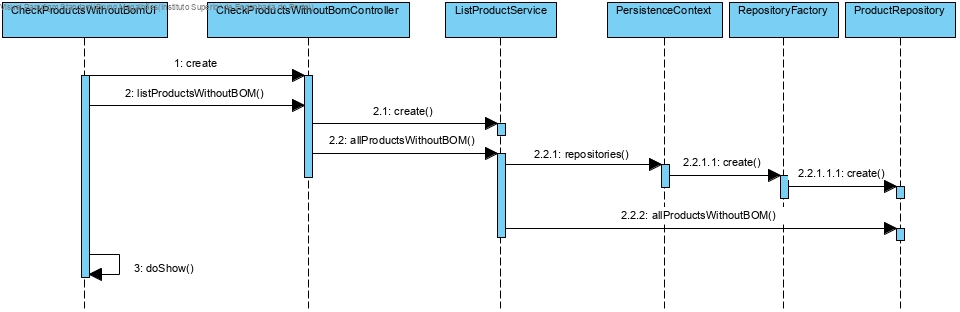
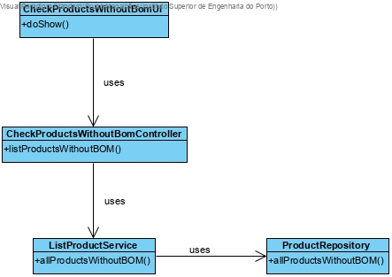

# Consultar produtos sem ficha de produção
=======================================

# 1. Requisitos

**Demo1** Como Gestor de Produção, eu quero consultar os produtos que não têm Ficha de Produção definida.

A interpretação feita deste requisito foi no sentido de criar uma forma do Gestor de Produção poder consultar quais produtos não têm ficha de produção

# 2. Análise

O gestor de produção usa o seu menu para consultar os produtos que não têm ficha de produção.

# 3. Design

Para responder a este problema foi usado o padrão *Controller* para criar o controlador **CheckProductsWithoutBomController**. Este controlador é responsável por coordenar todos os passos envolvidos na consulta dos produtos que não têm ficha de produção. O controlador fará uso do repositório **ProductRepository** para ter acesso à base de dados de produtos e proceder à posterior consulta dos produtos que não têm nenhuma Ficha de produção associada.

## 3.1. Realização da Funcionalidade

## 3.2. Diagrama de Classes

## 3.3. Padrões Aplicados

*Controller*
*Repository*

## 3.4. Testes

# 4. Implementação

*Nesta secção a equipa deve providenciar, se necessário, algumas evidências de que a implementação está em conformidade com o design efetuado. Para além disso, deve mencionar/descrever a existência de outros ficheiros (e.g. de configuração) relevantes e destacar commits relevantes;*

*Recomenda-se que organize este conteúdo por subsecções.*

# 5. Integração/Demonstração

*Nesta secção a equipa deve descrever os esforços realizados no sentido de integrar a funcionalidade desenvolvida com as restantes funcionalidades do sistema.*

# 6. Observações

*Nesta secção sugere-se que a equipa apresente uma perspetiva critica sobre o trabalho desenvolvido apontando, por exemplo, outras alternativas e ou trabalhos futuros relacionados.*
