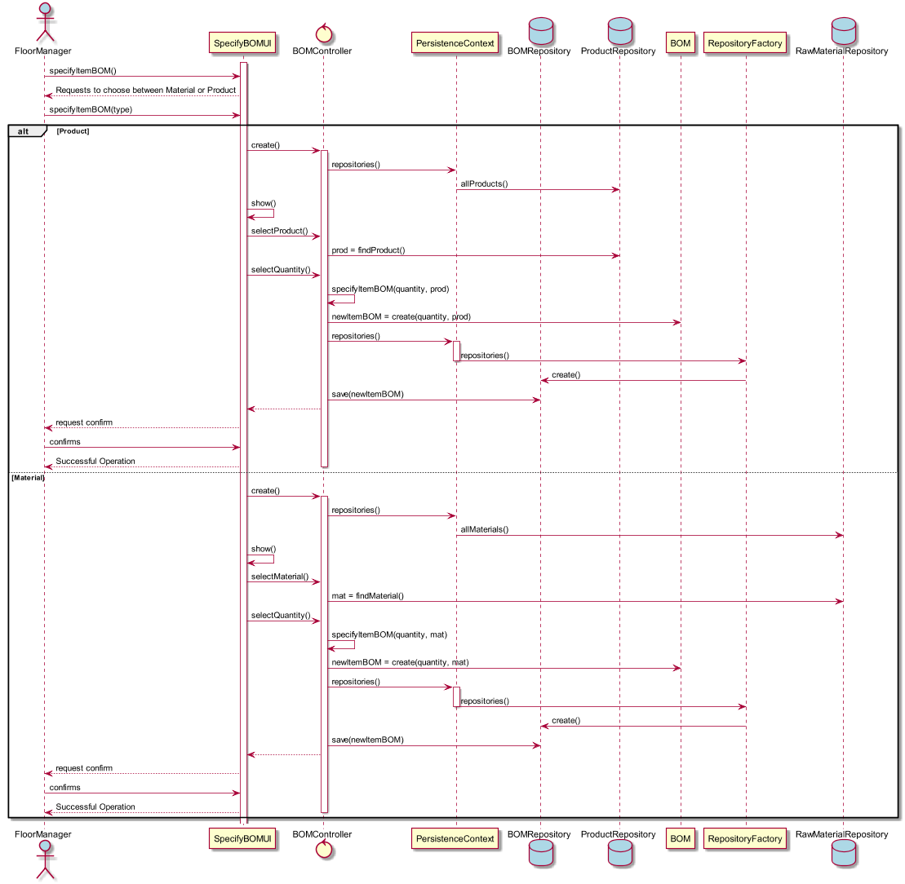

# Especificar Linha de Produção
=======================================

# 1. Requisitos

**US2004** - Como Gestor de Chão de Fábrica eu pretendo atribuir a um item (produto/materia-prima) uma ficha de produção.

A interpretação feita deste requisito foi no sentido de especificar no sistema a existência de uma nova linha de produção.

# 2. Análise

O gestor de chão de fábrica usa o seu menu para especificar a ficha de produção de um determinado produto/material.

# 3. Design

Para dar resposta a este caso de uso, foi usado o padrão *Controller*, visto na classe controladora **BOMController**. Este, é responsável pela organização e processo de criação de uma nova ficha de produção no sistema, correspondente a um item, e subsequentemente, na base de dados. O controlador usa a própria classe de domain **BOM** para criar a instância da mesma. E para a sua persistência na base de dados, conforme referido, é usado o **BOMRepository**.
O Gestor escolhe se quer atribuir uma ficha a um produto ou a uma matéria-prima, depois dessa decisão será apresentada uma lista do tipo escolhido, onde é solicitado novamente a escolha do item desejado.

## 3.1. Realização da Funcionalidade

## 3.3. Padrões Aplicados

* Controller
* Repository
* Factory

## 3.4. Testes

**Teste:** Verificar que não é possível criar uma quantidade negativa de qualquer item na ficha de produção.
**Teste:** Garantir que nao pode ser criada uma ficha de produção com valores nulos.

# 4. Implementação

*N/A*

# 5. Integração/Demonstração

*N/A*

# 6. Observações

*N/A*
