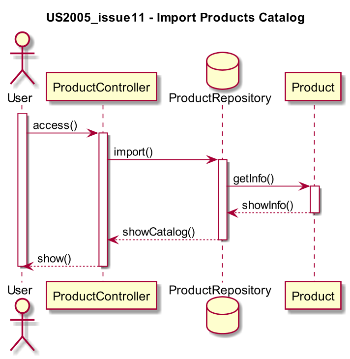

# US2005_issue11 - Import Products Catalog
=======================================

# 1. Requisitos

**US2005** Como Gestor de Produção, eu pretendo importar o catálogo de produtos através de um ficheiro de CSV.

A interpretação feita deste requisito foi no sentido de criar uma forma de carregar para a base de dados um catálodo de produtos, tendo por base um ficheiro .csv fornecido previamente.

# 2. Análise

Enquanto é desenvolvido o programa é de interesse que não se tenha de acrescentar informação na base de dados de modo a que possamos acrescentar dados a um catálogo. Sendo assim, a aplicação deverá ser capaz de carregar automaticamente.

# 3. Design

A forma encontrada para resolver este problema foi criar uma classe **ProductController** para criar instâncias de forma a garantir as regras de negócio dadas pelo cliente sem ter o intermédio de uma UI.

## 3.1. Realização da Funcionalidade

## * 3.2. Diagrama de Classes

## 3.3. Padrões Aplicados

* *Controller*

## * 3.4. Testes

*Nesta secção deve sistematizar como os testes foram concebidos para permitir uma correta aferição da satisfação dos requisitos.*

**Teste 1:** Verificar que não é possível criar uma instância da classe Exemplo com valores nulos.

	@Test(expected = IllegalArgumentException.class)
		public void ensureNullIsNotAllowed() {
		Exemplo instance = new Exemplo(null, null);
	}

# * 4. Implementação

*Nesta secção a equipa deve providenciar, se necessário, algumas evidências de que a implementação está em conformidade com o design efetuado. Para além disso, deve mencionar/descrever a existência de outros ficheiros (e.g. de configuração) relevantes e destacar commits relevantes;*

*Recomenda-se que organize este conteúdo por subsecções.*

# * 5. Integração/Demonstração

*Nesta secção a equipa deve descrever os esforços realizados no sentido de integrar a funcionalidade desenvolvida com as restantes funcionalidades do sistema.*

# * 6. Observações

*Nesta secção sugere-se que a equipa apresente uma perspetiva critica sobre o trabalho desenvolvido apontando, por exemplo, outras alternativas e ou trabalhos futuros relacionados.*
