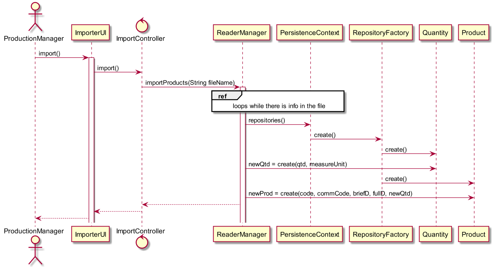

# Importar catálogo de produtos
=======================================

# 1. Requisitos

**US2005** - Como Gestor de Produção eu pretendo importar o catálogo de produtos através de um ficheiro CSV.

# 2. Análise

O gestor de produção usa o seu menu para importar o catálogo de produtos, adicionando-os ao repositorio dos mesmos. É o gestor que fornece o nome do ficheiro desejado.

# 3. Design

Foi usado o padrão *Controller*, visto na classe controladora **ImportController**. O controlador usa a própria classe **ReaderManager**, que por sua vez, utiliza a classe de domain **Product** para criar a instância dos mesmos a cada linha do ficheiroE para a sua persistência na base de dados, conforme referido, é usado o **ProductRepository**.
O Gestor insere o nome do ficheiro ou o seu path, e o sistema faz o resto.

## 3.1. Realização da Funcionalidade

## 3.3. Padrões Aplicados

* Controller
* Repository
* Factory

## 3.4. Testes

**Teste:** Verificar que não é possível criar uma quantidade negativa de qualquer item.
**Teste:** Validar a inserção de unidades reconhecidas.

# 4. Implementação

*N/A*

# 5. Integração/Demonstração

*N/A*

# 6. Observações

*N/A*
