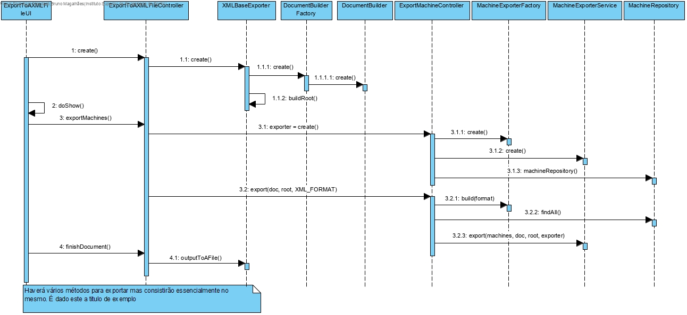
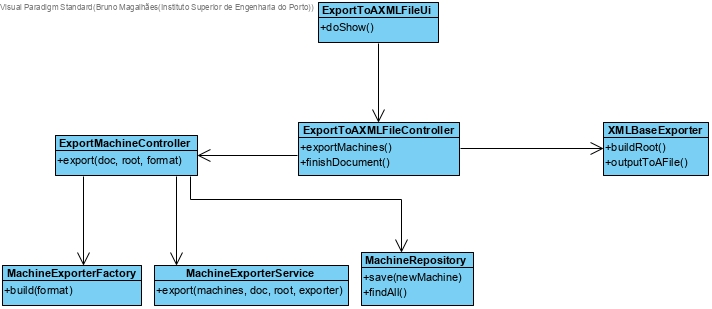

# Export Information about the factory floor To An XML File
=======================================

# 1. Requisitos

**Demo1** Como Gestor de Produção, eu pretendo exportar, para um ficheiro XML, toda a informação subjacente ao chão de fábrica.

# 2. Análise

O gestor de produção quer exportar informação para o sistema. Este usa o menu para decidir o que quer exportar para o ficheiro. Estas decisões ficam marcadas em flags numa classe que lida com as decisões. Quando o utilizador chega ao fim da tomada de decisões, uma instância desta classe é passada para o controlador que com base nas flags encaminha a exportação para cada dominio. O ficheiro exportado é em formato XML. O ficheiro exportado é validado por um ficheiro XSD.

# 3. Design

É criada uma interface "exportadora" que é implementada por cada agregado através de uma classe "exportadora de XML". Assim, com o uso da interface o código está preparado para receber alterações no futuro como outro tipo de ficheiro de exportação. Por outro lado, esta implementação também garante que apenas cada agregado sabe da sua informação. O controller instancia uma classe base de exportação que é encarregue de criar o documento XML e fazer a formatação básica do mesmo. O documento é depois passado para cada classe exportadora de XML que o utilizador pretender exportar. Esta classe exportadora é responsável por construir a estrutura do seu elemento XML e ir adicionando ao documento o conteúdo que o Gestor de Produção assim entender. O gestor de produção irá pela UI dizer o que pretende exportar. Cada uma destas decisões corresponde um método diferente no exportador de XML. No fim a classe base de exportação transforma o documento num ficheiro xml pronto a ler.

## 3.1. Realização da Funcionalidade

## 3.2. Diagrama de Classes

## 3.3. Padrões Aplicados

*Controller*

## 3.4. Testes

**Teste 1:** Verificar que nao é possivel adicionar um ficheiro de configuração com valor null.

	@Test(expected = IllegalArgumentException.class)
		public void ensureConfigFileUpdateHasNoNullFields(){
				addConfigFile(null);
		}

# 4. Implementação

*Nesta secção a equipa deve providenciar, se necessário, algumas evidências de que a implementação está em conformidade com o design efetuado. Para além disso, deve mencionar/descrever a existência de outros ficheiros (e.g. de configuração) relevantes e destacar commits relevantes;*

*Recomenda-se que organize este conteúdo por subsecções.*

# 5. Integração/Demonstração

*Nesta secção a equipa deve descrever os esforços realizados no sentido de integrar a funcionalidade desenvolvida com as restantes funcionalidades do sistema.*

# 6. Observações

*Nesta secção sugere-se que a equipa apresente uma perspetiva critica sobre o trabalho desenvolvido apontando, por exemplo, outras alternativas e ou trabalhos futuros relacionados.*
