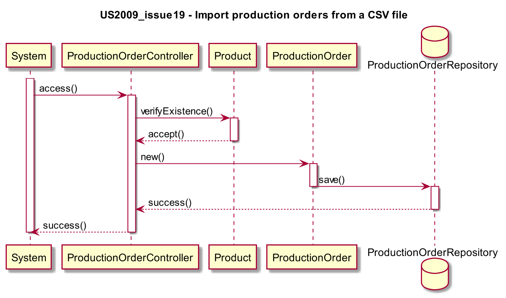
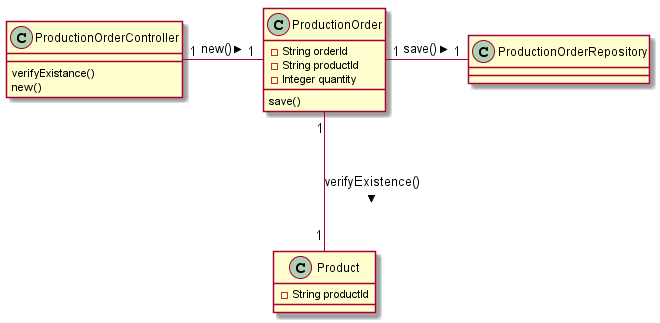

# US2009_issue19 - Importar ordens de produção através de um ficheiro CSV
=======================================

# 1. Requisitos

**US2009** Como Gestor de Produção, eu pretendo importar ordens de produção através de um ficheiro CSV.

A interpretação feita deste requisito foi no sentido de criar uma forma de carregar, para a aplicação, uma lista que contenha uma diversidade de ordens de produção, capazes de serem reconhecidas pelo sistema.

# 2. Análise

Durante a execução do programa é importante termos a opção de, a qualquer momento, podermos carregar e/ou adicionar mais ordens de produção às ordens de produção já existentes na aplicação.

# 3. Design

A forma encontrada para resolver este problema foi criar uma classe **ProductionOrder** a qual é referente a um **Product** em particular.
Assim sendo, através da classe **ProductionOrderController** iremos aceder à classe **Product** de modo a verificar se esse produto já existe, se tal não se verificar, a classe **ProductionOrder** irá ser chamada e como tal uma nova ordem de produção será adicionada ao **ProductionOrderRepository**.
A importação das ordens de produção será feita através da classe **ProductionOrderController**.

## 3.1. Realização da Funcionalidade

## 3.2. Diagrama de Classes

## 3.3. Padrões Aplicados

* *Controller*

## * 3.4. Testes

*Nesta secção deve sistematizar como os testes foram concebidos para permitir uma correta aferição da satisfação dos requisitos.*

**Teste 1:** Verificar que não é possível criar uma instância da classe Exemplo com valores nulos.

	@Test(expected = IllegalArgumentException.class)
		public void ensureNullIsNotAllowed() {
		Exemplo instance = new Exemplo(null, null);
	}

# * 4. Implementação

*Nesta secção a equipa deve providenciar, se necessário, algumas evidências de que a implementação está em conformidade com o design efetuado. Para além disso, deve mencionar/descrever a existência de outros ficheiros (e.g. de configuração) relevantes e destacar commits relevantes;*

*Recomenda-se que organize este conteúdo por subsecções.*

# * 5. Integração/Demonstração

*Nesta secção a equipa deve descrever os esforços realizados no sentido de integrar a funcionalidade desenvolvida com as restantes funcionalidades do sistema.*

# * 6. Observações

*Nesta secção sugere-se que a equipa apresente uma perspetiva critica sobre o trabalho desenvolvido apontando, por exemplo, outras alternativas e ou trabalhos futuros relacionados.*
