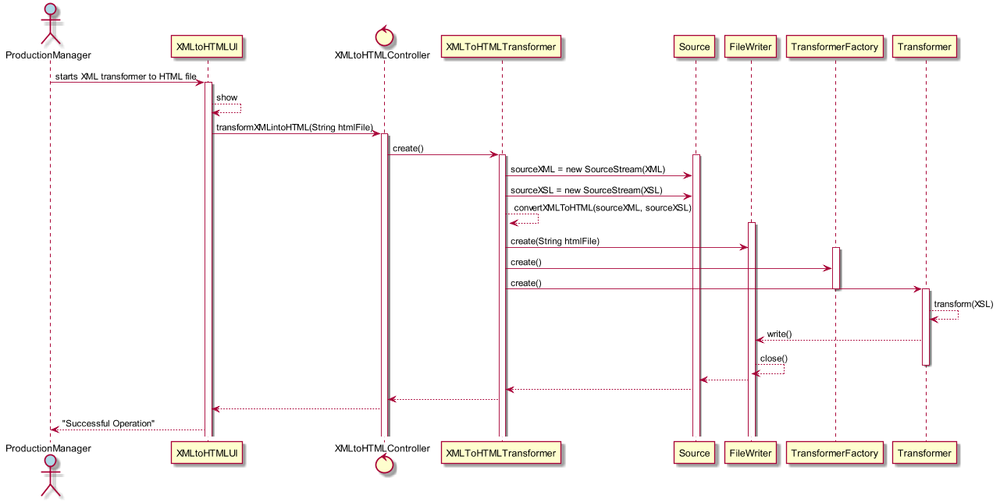
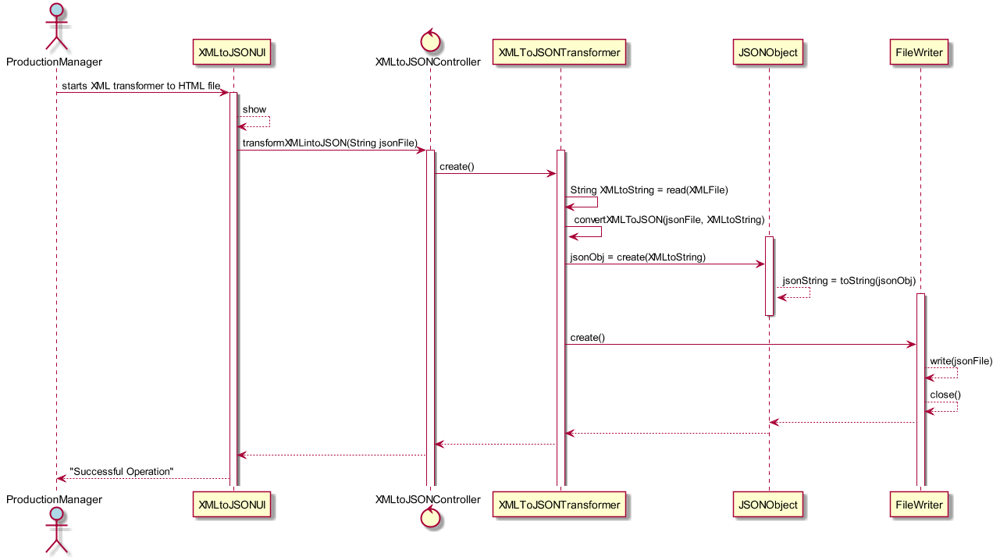
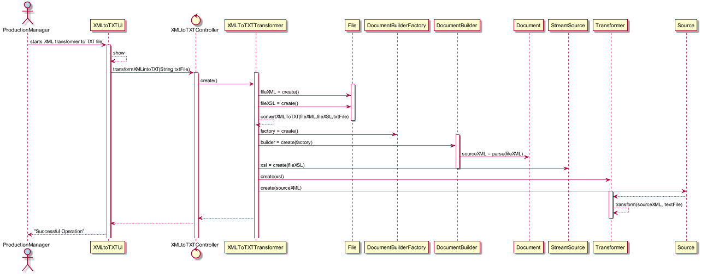

# Pretendo aplicar uma visualização/transformação (das várias disponiveis) a um ficheiro XML anteriormente gerado/exportado por mim (através do sistema)
=======================================

# 1. Requisitos

**US2013** - Como gestor de Produção, eu Pretendo aplicar uma visualização/transformação (das várias disponiveis) a um ficheiro XML anteriormente gerado/exportado por mim (através do sistema).

A interpretação feita deste requisito foi no sentido de o gestor de produção, poder escolher 1 de 3 formatos para proceder á transformação do XML ja previamente exportado num dos ditos formatos, sendo eles, JSON, HTML e Texto.

# 2. Análise

Esta Funcionalidade será desencadeada a partir da UI, pela acção esperada do Gestor de Produção.
Este, vai aceder ao seu Menu, onde lhe será dada a opção de transformar o XML da informação de chão de fábrica, num ficheiro *HTML*, *JSON* ou *Texto*. O nome do ficheiro destino será solicitado. Após a seleção de uma das opcões, o respectivo controller, é responsável pela interação com as classes responsáveis pelo processo de transformação.
###### XML para HTML:
Para esta transformação, serão necessárias bibliotecas nativas do Java. Serão necessárias, *TransformerFactory*, que será usada para criar objectos *Transformer* que efetuam transformações de documentos, e que neste caso, servirá para interpretação de um XSLT.
A classe acima mencionada necessita então de essencialmente um XML para converter e um XSL para atribuição de regras de transformação, para isso, *StreamSource* vai ser usada como um 'contentor' da informação contida nestes documentos, e depois será então feita a transformação e escrita da informação dos mesmos através de um *FileWriter*.
###### XML para JSON:
Para esta conversão, será necessária uma dependência de *org.json*, que nos permitirá o uso de *JSONObject*. Este objecto permite a chamada de métodos de instância que permitem a transformação de XML para JSON. Para isso, antes será necessário usar a classe nativa do Java *BufferedReader* para a leitura do XML e depois o uso da classe Collectors para proceder à passagem de XML para uma String. Essa String será usada pelo *JSONObject*. Após este processo, será usado um *FileWriter*, como já explicado acima na transformação de XML para HTML.
###### XML para TXT:
Para esta conversão, será necessário o uso da  *SAX* API, e de várias classes nativas Java. Inicialmente são criados dois objectos File, um relativo ao XML, e outro relativo ao XSL. Juntamente com o nome que o utilizador der ao ficheiro .txt de destino, estes serão os 3 parâmetros principais do método que fará a conversão. Vai ser utilizado o *DocumentBuilderFactory* que fornecerá uma factory API que possibilita a aplicação de obter um parser que produz objectos *DOM* a partir de documentos XML, como é o caso. Usaremos também o *DocumentBuilder* e o *Document* para armazenar a totalidade da informação presente num XML através de um parser, fornecido através de um método de instância da classe acima mencionada.
Vamos usar *StreamSource*, conforme usado na conversão de XML para HTML, para ser o 'contentor' da informação presente no XSL, e também a classe *Transformer* que fornece o método de conversão final, recebendo um *DOMSource* e *Result* como parâmetro, sendo que *DOMSource* será o ficheiro XML 'preparado' para conversão, e o *Result* será o ficheiro destino, neste caso, um .txt.

# 3. Design

O padrão *Controller* foi usado, em **XMLtoHTMLcontroller**,**XMLtoJSONcontroller**.
O Gestor de produção, através da UI tem acesso ao controller mencionado, e dá inicio à cadeia de eventos relacionados com a transformação do XML num ficheiro HTML/JSON, como descrito acima.
O controller recebe do input da UI apenas o nome do ficheiro destino de HTML/JSON, e depois gere o caso de uso usando as funcionalidades fornecidas pelas classes enunciadas na Análise.

## 3.1. Realização da Funcionalidade

##### Transformation to HTML

-----------------------------------------------------------------------------
##### Transformation to JSON

-----------------------------------------------------------------------------
##### Transformation to TXT

-----------------------------------------------------------------------------

## 3.3. Padrões Aplicados

* Controller

## 3.4. Testes

*N/A*

# 4. Implementação

*N/A*

# 5. Integração/Demonstração

*N/A*

# 6. Observações
###### Adicionada ao POM a seguinte dependência para o uso de JSONObject:
        <dependency>
            <groupId>org.json</groupId>
            <artifactId>json</artifactId>
            <version>20180813</version>
            <type>jar</type>
        </dependency>
