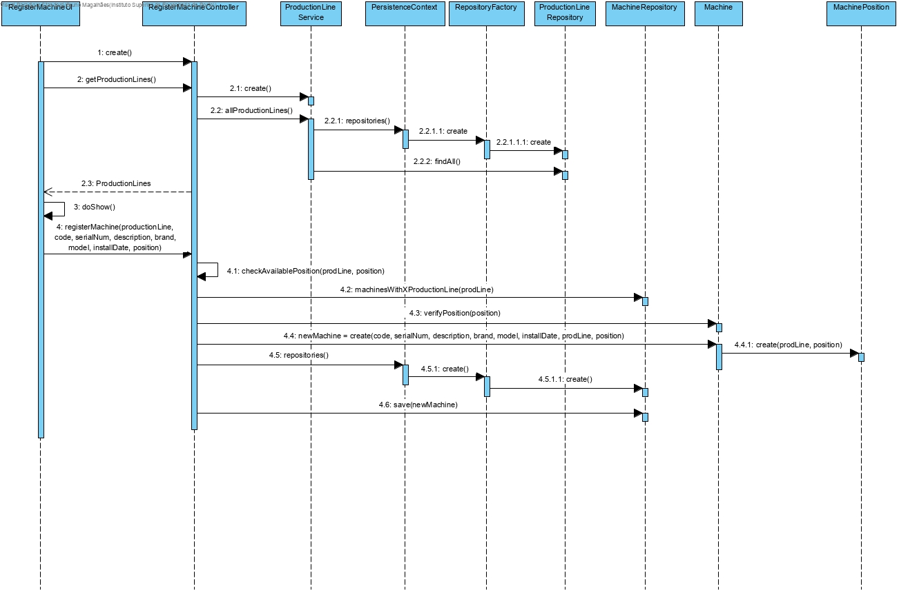
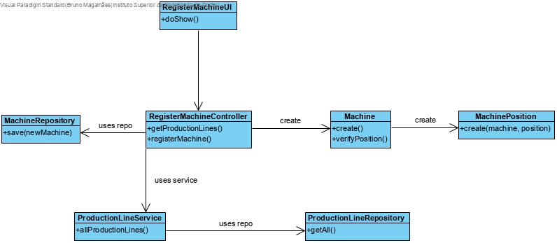

# Registar Máquina
=======================================

# 1. Requisitos

*Nesta secção a equipa deve indicar a funcionalidade desenvolvida bem como descrever a sua interpretação sobre a mesma e sua correlação e/ou dependência de/com outros requisitos.*

*Exemplo*

**Demo1** Como Gestor de Chão de Fábrica eu pretendo definir a existência de uma nova máquina.

A interpretação feita deste requisito foi no sentido de especificar no sistema a existência de uma nova máquina.

# 2. Análise

O gestor de chão de fábrica usa o seu menu para definir a existência de uma nova máquina.
Uma das regras de negócio associadas a este caso de uso é que uma máquina apenas existe no contexto de uma linha de produção.
O utilizador pode criar uma máquina sem associar um ou mais ficheiros de configuração ou informação sobre o protocolo de comunicação mas todos os outros campos são obrigatórios como numero de série, descrição, código interno, data de instalação, marca e modelo.
O numero de série das máquinas é único.

# 3. Design

Para responder a este problema foi usado o padrão *Controller* para criar o controlador **RegisterMachineController**. Este controlador é responsável pela organização e tratamento do processo de criação de uma nova máquina no sistema. Este controlador por sua vez faz uso da classe **Machine** para criar uma instância de máquina. Para persistir esta informação no sistema é usado o padrão *Repository*. O controlador usa **MachineRepository** para guardar a informação em base de dados.

Tendo em conta que uma máquina só existe no contexto de uma linha de produção. O controller faz uso de um serviço **ProductionLineService** para consultar as linhas de produção disponiveis de forma ao utilizador poder ver qual pretende. O controller começa por obter as linhas de produção atuais no sistema de forma ao gestor de fábrica poder escolher a qual linha de produção quer associar a máquina. Quando o gestor decidir em que linha de produção quer colocar a nova máquina e em que posição, pode então especificar a máquina. O controller verifica se a posição dada pelo utilizador para aquela linha de produção está disponivel e instância a máquina ou lanca excepção caso não esteja disponivel.

## 3.1. Realização da Funcionalidade

## 3.2. Diagrama de Classes

## 3.3. Padrões Aplicados

*Controller*
*Repository*

*Nesta secção deve apresentar e explicar quais e como foram os padrões de design aplicados e as melhores práticas*

## 3.4. Testes

**Teste 1 a 6:** Verificar que não é possível criar uma instância da classe Machine com valores nulos em code, brand, model, serial number, installation date and description.

	@Test(expected = IllegalArgumentException.class)
		public void ensureMachineCantHaveNull<XField>() {
		new Machine(every field not null except for XField);
	}

**Teste 7:** Verificar que não é possível criar uma instância da classe Machine sem o SerialNumber obedecer às restrições aplicadas pelo cliente.

		public void ensureSerialNumberCodeMeetsTheCorrectSize() {
		new SerialNumber("PA47MF46M"));
	}

**Teste 8:** Verificar que nao é possivel criar uma instância de MachinePosition com valores null.

	@Test(expected = IllegalArgumentException.class)
		public void ensureMachinePositionHasNoNullFields(){
				new MachinePosition(null, 5);
		}

# 4. Implementação

*Nesta secção a equipa deve providenciar, se necessário, algumas evidências de que a implementação está em conformidade com o design efetuado. Para além disso, deve mencionar/descrever a existência de outros ficheiros (e.g. de configuração) relevantes e destacar commits relevantes;*

*Recomenda-se que organize este conteúdo por subsecções.*

# 5. Integração/Demonstração

*Nesta secção a equipa deve descrever os esforços realizados no sentido de integrar a funcionalidade desenvolvida com as restantes funcionalidades do sistema.*

# 6. Observações

*Nesta secção sugere-se que a equipa apresente uma perspetiva critica sobre o trabalho desenvolvido apontando, por exemplo, outras alternativas e ou trabalhos futuros relacionados.*
