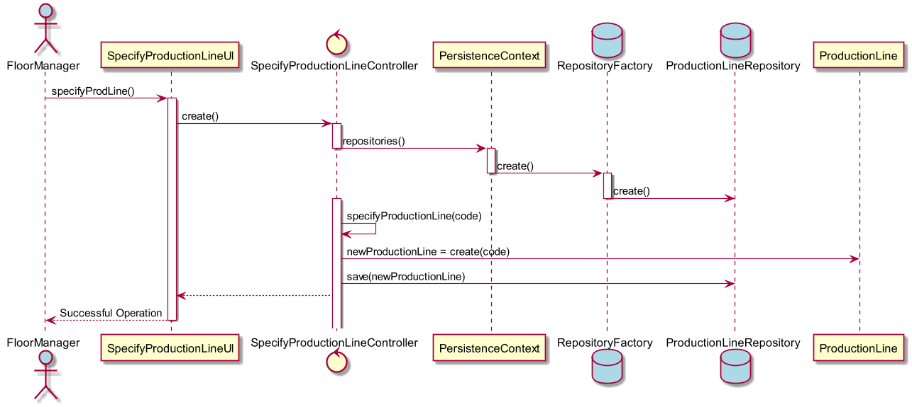

# Especificar Linha de Produção
=======================================

# 1. Requisitos

**US3002** - Como Gestor de Chão de Fábrica eu pretendo definir a existência de uma nova linha de produção.

A interpretação feita deste requisito foi no sentido de especificar no sistema a existência de uma nova linha de produção.

# 2. Análise

O gestor de chão de fábrica usa o seu menu para definir a existência de uma nova linha de produção.

# 3. Design

Para dar resposta a este caso de uso, foi usado o padrão *Controller*, visto na classe controladora **SpecifyProductionLineController**. Este, é responsável pela organização e processo de criação de uma nova linha de produção no sistema, e subsequentemente, na base de dados. O controlador usa a própria classe de domain **ProductionLine** para criar a instância da mesma. E para a sua persistência na base de dados, conforme referido, é usado o **ProductionLineRepository**.

## 3.1. Realização da Funcionalidade

## 3.3. Padrões Aplicados

* Controller
* Repository
* Factory

## 3.4. Testes

**Teste:** Garantir que nao pode ser criada uma linha de produção com valores nulos.

# 4. Implementação

*N/A*

# 5. Integração/Demonstração

*N/A*

# 6. Observações

*N/A*
