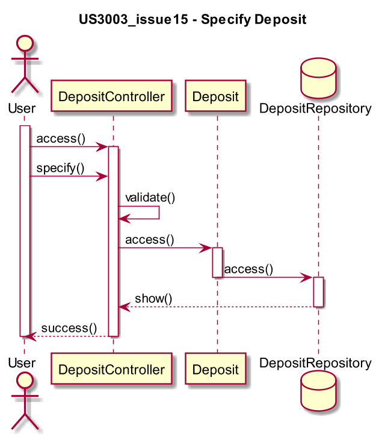

# US3003_issue15 - Specify Deposit
=======================================

# 1. Requisitos

**US3003** Como Gestor de Chão de Fábrica, eu pretendo especificar a existência de um novo depósito.

A interpretação feita deste requisito foi no sentido de criar uma forma de carregar para a base de dados alguns produtos, assim que a aplicação é inicializada.

# 2. Análise

Durante a execução do programa é importante termos a opção de, a qualquer momento, podermos especificar o depósito ao qual queremos ter acesso.

# 3. Design

A forma encontrada para resolver este problema foi criar uma classe **DepositController** que faz uso do **DepositRepository** de modo a acedermos a toda a informação existente num determinado depósito do sistema.

## 3.1. Realização da Funcionalidade

## * 3.2. Diagrama de Classes

## 3.3. Padrões Aplicados

* *Controller*

## * 3.4. Testes

*Nesta secção deve sistematizar como os testes foram concebidos para permitir uma correta aferição da satisfação dos requisitos.*

**Teste 1:** Verificar que não é possível criar uma instância da classe Exemplo com valores nulos.

	@Test(expected = IllegalArgumentException.class)
		public void ensureNullIsNotAllowed() {
		Exemplo instance = new Exemplo(null, null);
	}

# * 4. Implementação

*Nesta secção a equipa deve providenciar, se necessário, algumas evidências de que a implementação está em conformidade com o design efetuado. Para além disso, deve mencionar/descrever a existência de outros ficheiros (e.g. de configuração) relevantes e destacar commits relevantes;*

*Recomenda-se que organize este conteúdo por subsecções.*

# * 5. Integração/Demonstração

*Nesta secção a equipa deve descrever os esforços realizados no sentido de integrar a funcionalidade desenvolvida com as restantes funcionalidades do sistema.*

# * 6. Observações

*Nesta secção sugere-se que a equipa apresente uma perspetiva critica sobre o trabalho desenvolvido apontando, por exemplo, outras alternativas e ou trabalhos futuros relacionados.*
