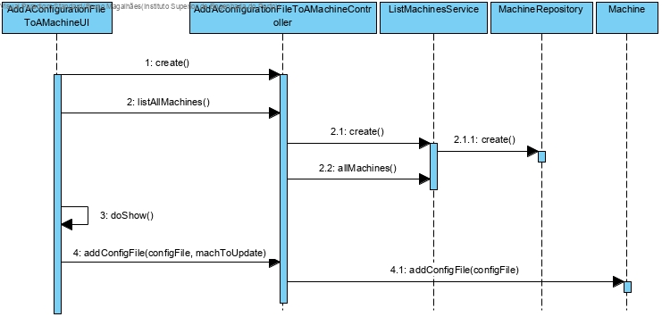
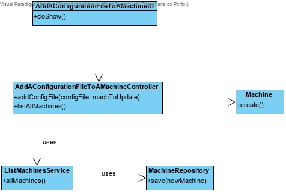

# Add a configuration file to a machine
=======================================

# 1. Requisitos

**Demo1** Como Gestor de Chão de Fábrica, eu pretendo associar um ficheiro de configuração a uma máquina.

A interpretação feita deste requisito foi no sentido de criar uma forma de adicionar um ficheiro de configuração a uma máquina.

# 2. Análise

O gestor de chão de fábrica usa o menu para adicionar um ficheiro de configuração a uma máquina. Tendo em conta que não existe uma estrutura definida para um ficheiro de configuração, a implementação tem de ter em conta esta mutabilidade.

# 3. Design

O modelo de dominio atual permite resolver este problema. A forma encontrada para dar solução foi criar uma classe **AddAConfigurationFileToAMachineUI** que faz uso do **AddAConfigurationFileToAMachineController** para adicionar uma configuração a uma máquina selecionada pelo cliente.

## 3.1. Realização da Funcionalidade

## 3.2. Diagrama de Classes

## 3.3. Padrões Aplicados

*Service*
*Controller*

## 3.4. Testes

**Teste 1:** Verificar que nao é possivel adicionar um ficheiro de configuração com valor null.

	@Test(expected = IllegalArgumentException.class)
		public void ensureConfigFileUpdateHasNoNullFields(){
				addConfigFile(null);
		}

# 4. Implementação

*Nesta secção a equipa deve providenciar, se necessário, algumas evidências de que a implementação está em conformidade com o design efetuado. Para além disso, deve mencionar/descrever a existência de outros ficheiros (e.g. de configuração) relevantes e destacar commits relevantes;*

*Recomenda-se que organize este conteúdo por subsecções.*

# 5. Integração/Demonstração

*Nesta secção a equipa deve descrever os esforços realizados no sentido de integrar a funcionalidade desenvolvida com as restantes funcionalidades do sistema.*

# 6. Observações

*Nesta secção sugere-se que a equipa apresente uma perspetiva critica sobre o trabalho desenvolvido apontando, por exemplo, outras alternativas e ou trabalhos futuros relacionados.*
