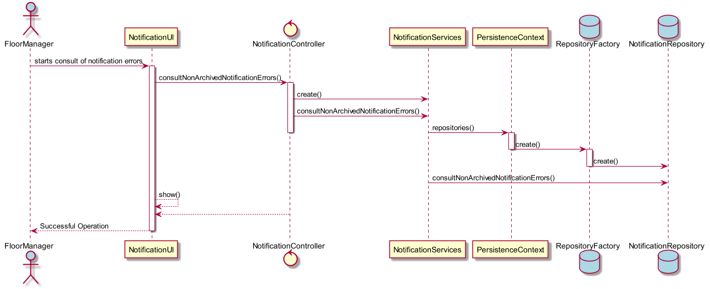

# Consultar as notificações de erros de processamento por tratar
=======================================

# 1. Requisitos

**US3005** - Como Gestor de Chão de Fábrica eu pretendo consultar as notificações de erros de processamento por tratar (não arquivadas).

A interpretação feita deste requisito foi no sentido de o gestor poder ver através do seu menu apenas as notificações não tratadas, para que possa tomar uma acção de seguida.

# 2. Análise

O gestor de chão de fábrica usa o seu menu para fazer a consulta das notificações de erros.

# 3. Design

Foi usado o padrão *Controller*, como se pode ver como **NotificationController**. É também usada uma classe de 'Serviço' intermédia **NotificationServices**, que retira a responsabilidade do controller fazer consultas, ficando esta classe encarregue deste tipo de funções. Esta classe, é responsável pela organização e processo de consultas de notificações de erro no sistema, e subsequentemente, na base de dados. A persistência na base de dados, está feita por **NotificationRepository**.

## 3.1. Realização da Funcionalidade

## 3.3. Padrões Aplicados

* Controller
* Repository
* Factory

## 3.4. Testes

**Teste:** Verificar que são solicitadas apenas notificações por tratar.

# 4. Implementação

*N/A*

# 5. Integração/Demonstração

*N/A*

# 6. Observações

*N/A*
