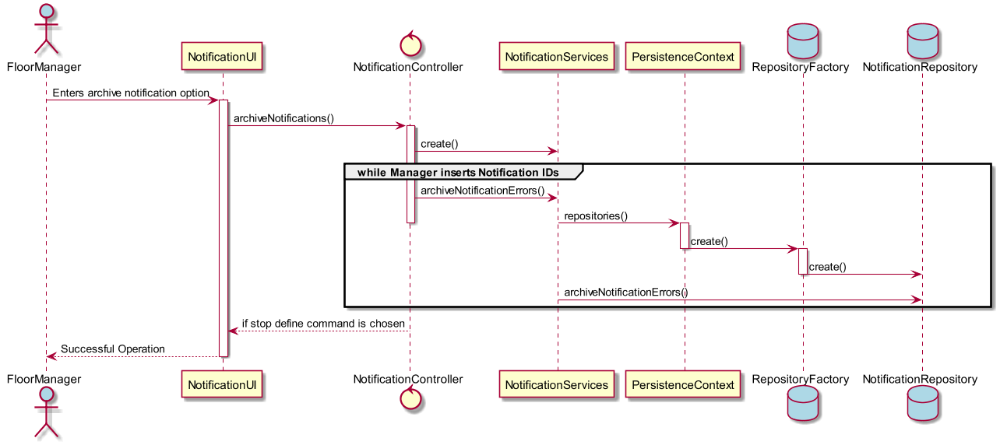

# Arquivar uma ou mais notificações de erros de processamento
=======================================

# 1. Requisitos

**US3006** - Como Gestor de Chão de Fábrica eu pretendo arquivar uma ou mais notificações de erros de processamento.

A interpretação feita deste requisito foi no sentido de o gestor de chão de fábrica através do seu menu poder arquivar as notificações de erro que desejar através da inserção dos seus ID's, pois dado o caso de uso 3005, onde é feita a consulta das mesmas, o gestor deverá saber os ID's das notificações que deseja arquivar.

# 2. Análise

O gestor de chão de fábrica usa o seu menu para fazer a consulta das notificações de erros.

# 3. Design

Foi usado o padrão *Controller*, em **NotificationController**. É também usada a classe de 'Serviço' intermédia **NotificationServices** à semelhança da user story anterior (3005), que retira a responsabilidade do controller fazer consultas, ficando esta classe encarregue deste tipo de funções, conforme também já explicado previamente. Esta classe, é responsável pela organização e processo de consultas de notificações de erro no sistema, e subsequentemente, na base de dados. É através desta que será feita a tarefa de "arquivar" as notificações. A persistência na base de dados, está feita por **NotificationRepository**.

## 3.1. Realização da Funcionalidade

## 3.3. Padrões Aplicados

* Controller
* Repository
* Factory

## 3.4. Testes

**Teste:** Apenas notificações com o estado de "arquivadas" a false, podem ser manipuladas..

# 4. Implementação

*N/A*

# 5. Integração/Demonstração

*N/A*

# 6. Observações

*N/A*
