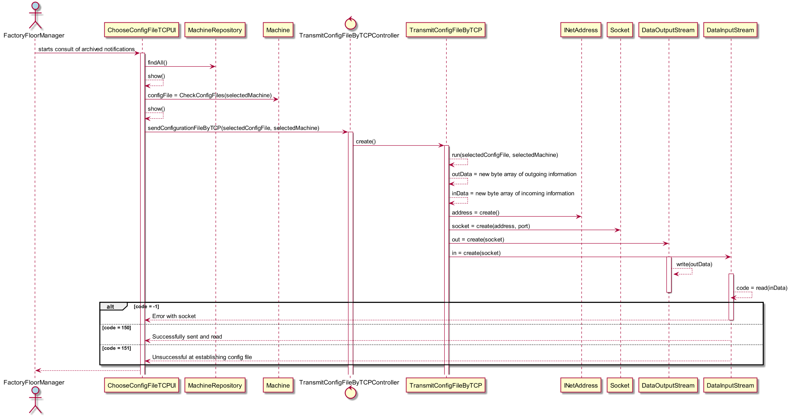

# Envio de uma determinada configuração para uma máquina
=======================================

# 1. Requisitos

**US3010** - Como Gestor de Chão de Fábrica, pretendo solicitar o envio de uma determinada configuração para uma máquina

A interpretação feita deste requisito foi no sentido de o gestor de Chão de Fábrica, poderia escolher uma das máquinas existentes e atribuir uma configuração à mesma. Isto é, dado que cada máquina pode ter mais do que uma configuração, isto iria possibilitar uma "atualização" da configuração da máquina a um dado momento. O gestor de fábrica, através de uma funcionalidade prévia, pode efetuar o upload de uma configuração a partir de um ficheiro externo, e agora com esta funcionalidade pode de facto a partir de uma configuration file que já é do conhecimento da máquina, enviá-la para a mesma para que esta passe a executar de acordo com as funções descritas neste ficheiro.

# 2. Análise

Para a resolução desta funcionalidade, será necessária comunicação client-server em *TCP*.
Dado que será carregada uma configuração na forma de String no pacote a ser enviado através de um socket, o array de bytes que identifica esse mesmo pacote, terá de ser preparado para receber diferentes tamanhos de informação contida nesta String. Serão necessárias as classes *DataOutputStream* e *DataInputStream* para encapsular a informação a ser enviada no pacote. Após atribuído o código de pedido de "config" e encapsulada a informação relativa à configuração, assim como a informação da máquina escolhida, procederemos ao envio da mesma através de um socket previamente estabelecido. O server side deverá estar sempre receptivo a qualquer tipo de mensagens, e ao encontrar uma mensagem com o código de configuração estabelecido no protocolo, deve proceder à sua atribuição à máquina designada, e se isto for feito com sucesso, deve responder através do socket com uma mensagem ACK, reconhecendo o sucesso da operação. Caso contrário, deverá enviar um NACK. Códigos 150 e 151, respectivamente.

# 3. Design

Esta funcionalidade vai ter início, com o login do Gestor de Chão de Fábrica e acesso ao seu menu específico. Este vai aceder, às opções relativas às máquinas e ao selecionar a opção de atribuição de uma configuração a uma máquina através de TCP, dará início à cadeia de eventos deste caso de uso. Serão apresentadas as máquinas para escolha, e depois disso, serão listadas as configurações da mesma, para escolha de envio. A escolha de uma máquina sem nenhuma configuração, deve mostrar uma mensagem sugestiva.
Foi usado o padrão *Controller*, em **TransmitConfigFileByTCPController**. O controller será a classe 'intermediária', que se coordenará à classe principal responsável pela comunicação em TCP e passará à mesma, a máquina escolhida e a configuração que esta vai assumir. Esta classe, conforme descrito na análise, vai proceder ao envio da informação necessária para atribuição da configuração a uma máquina, informação esta encapsulada num pacote e enviada através de um socket.

## 3.1. Realização da Funcionalidade

## 3.3. Padrões Aplicados

* Controller

## 3.4. Testes

*N/A*

# 4. Implementação

*N/A*

# 5. Integração/Demonstração

*N/A*

# 6. Observações

*N/A*
