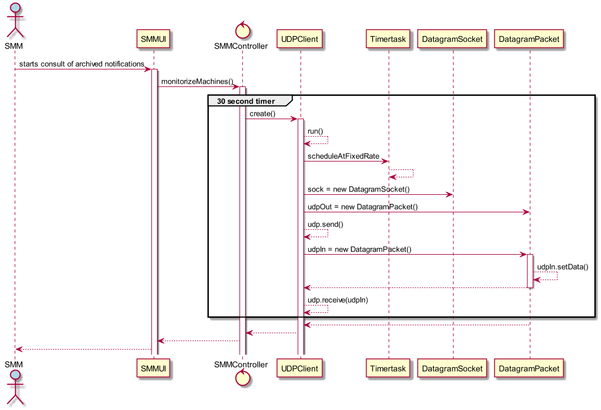

# Monitorizar o estado das máquinas
=======================================

# 1. Requisitos

**US6001** - Como Sistema de Monitorização das Máquinas (SMM), pretendo monitorizar o estado das máquinas.

A interpretação feita deste requisito foi no sentido de o SMM, que seria um módulo à parte e executado à parte, onde o Client side de Java, estabelecia comunicação com o Server side de C, ligado ao servidor do DEI. É enviado uma mensagem HELLO, e o sistema fica à escuta de resposta por parte do servidor, num determinado scheduled time.
PS: No entanto, face ao atraso do grupo, será contemplada uma resolução a partir da backoffice UI, a ser corrigido no próximo Sprint.

# 2. Análise

O SMM é executado através do menu principal para estabelecer a comunicação com as máquinas.

# 3. Design

Foi usado o padrão *Controller*, em **SMMController**. Através do acesso ao SMM, a UI acesso ao controller mencionado, que dá inicio ao Timertask de 30 em 30 segundos e durante esse período estabelece a ligação UDP por socket para comunicação com o servidor e procede ao envio do pedido e da resposta, efetuando um timeout se resposta não for obtida.

## 3.1. Realização da Funcionalidade

## 3.3. Padrões Aplicados

* Controller

## 3.4. Testes

**Teste:** Timeout se não houver resposta durante um tempo pré-estabelecido.

# 4. Implementação

*N/A*

# 5. Integração/Demonstração

*N/A*

# 6. Observações

*N/A*
