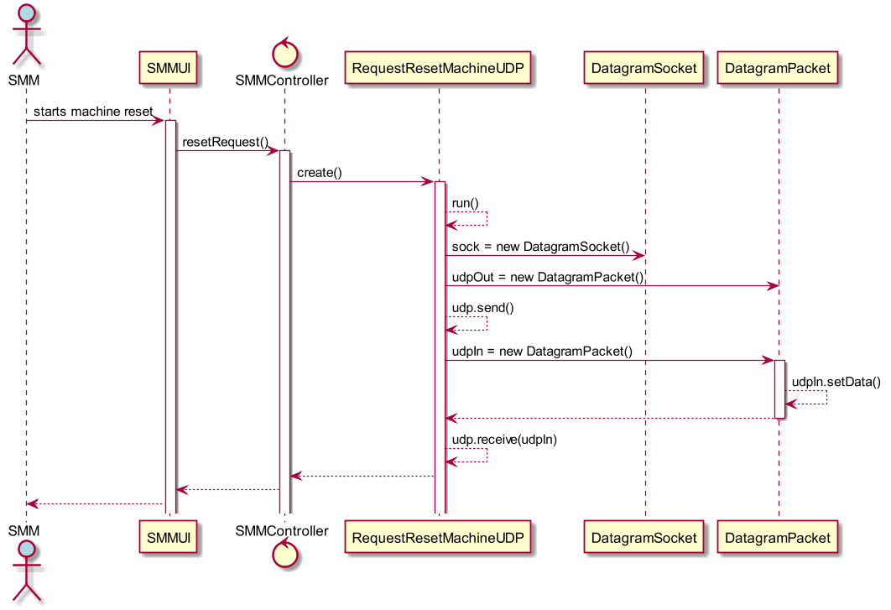

# Pretendo enviar um pedido de reinicialização para uma dada máquina
=======================================

# 1. Requisitos

**US6002** - Como SMM, eu pretendo enviar um pedido de reinicialização para uma dada máquina.

A interpretação feita deste requisito foi no sentido de o SMM, que seria um módulo à parte e executado à parte, onde o Client side de Java, estabelecia comunicação com o Server side de C, ligado ao servidor do DEI. É enviado uma mensagem RESET, e o sistema fica à escuta de resposta por parte do servidor, servidor esse (C), que vai comunicar com o sistema central e depois proceder à resposta ao SMM. O SMM fica à escuta desta resposta.

# 2. Análise

O SMM será executado a partir de um login específico de um utilizar "Monitorization System". Após inicialização da opção do pedido de reset, terá de ser aberta uma socket, para comunicação com o server side, através duma porta estabelecida. O pedido é um codigo inteiro '3', que é enviado no segundo byte do array de 6 bytes usado para a comunicação através de um pacote de dados. Depois de estabelecida a socket, é feito o envio e o programa fica à escuta de resposta. Durante este tempo, o server side em C vai comunicar com o sistema central, e proceder à simulação de reinicialização da máquina. O código a receber será idealmente 150, ACK, dando conta que a máquina se encontra de novo operacional. A reinicialização demorará não mais de 10 segundos de uma forma geral, pelo que existirá um socket timeout de 15 segundos caso não seja obtida resposta.

# 3. Design

O padrão *Controller* foi usado, em **SMMController**. Através do acesso ao SMM, a UI tem acesso ao controller mencionado, que dá inicio à cadeia de eventos relacionados com o reset da máquina, mencionada acima na Análise. UI -> Controller, o código é enviado e o processo a correr fica a aguardar resposta, assim que a obtenha, é mostrada uma mensagem de sucesso pertinente, se não for obtida resposta num tempo predeterminado, é lançada uma timeout exception da socket.

## 3.1. Realização da Funcionalidade

## 3.3. Padrões Aplicados

* Controller

## 3.4. Testes

**Teste:** Timeout se não houver resposta durante um tempo pré-estabelecido. (15 segundos)

# 4. Implementação

*N/A*

# 5. Integração/Demonstração

*N/A*

# 6. Observações

*N/A*
